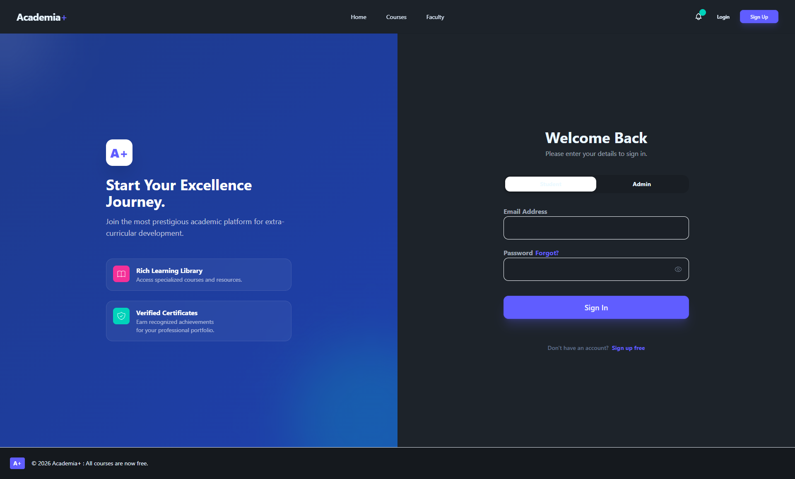
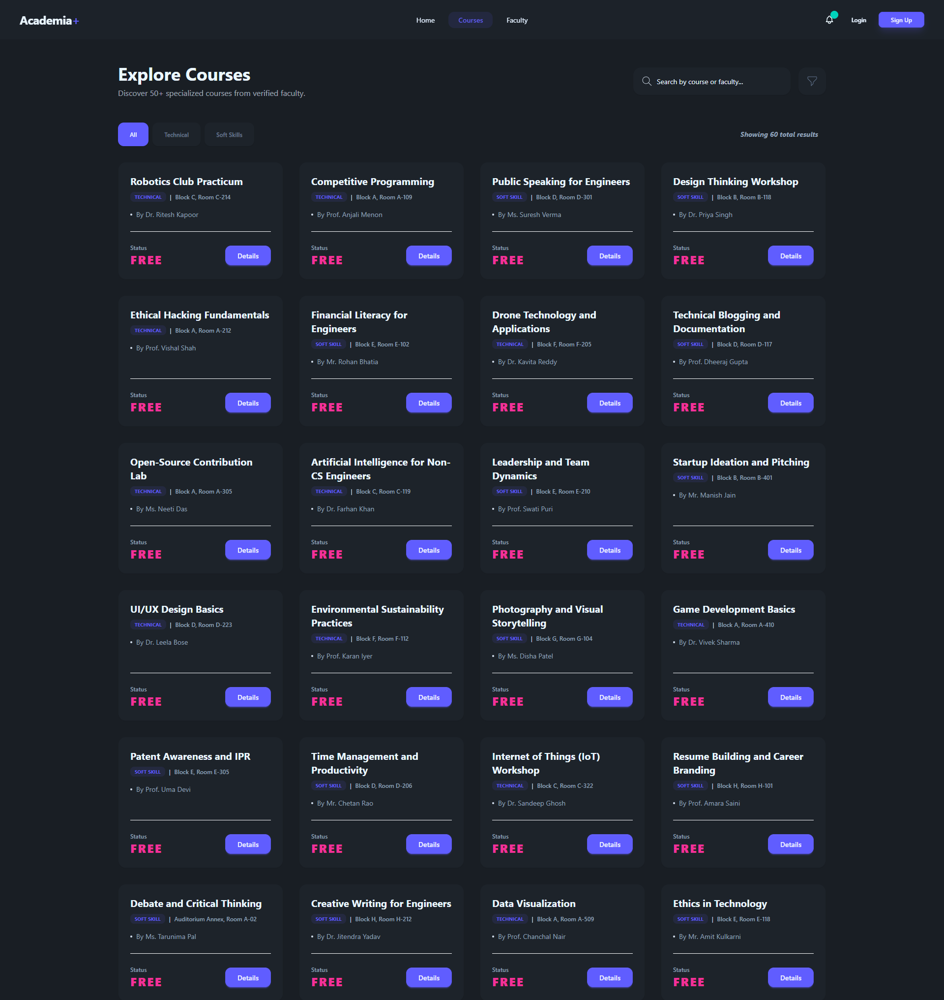
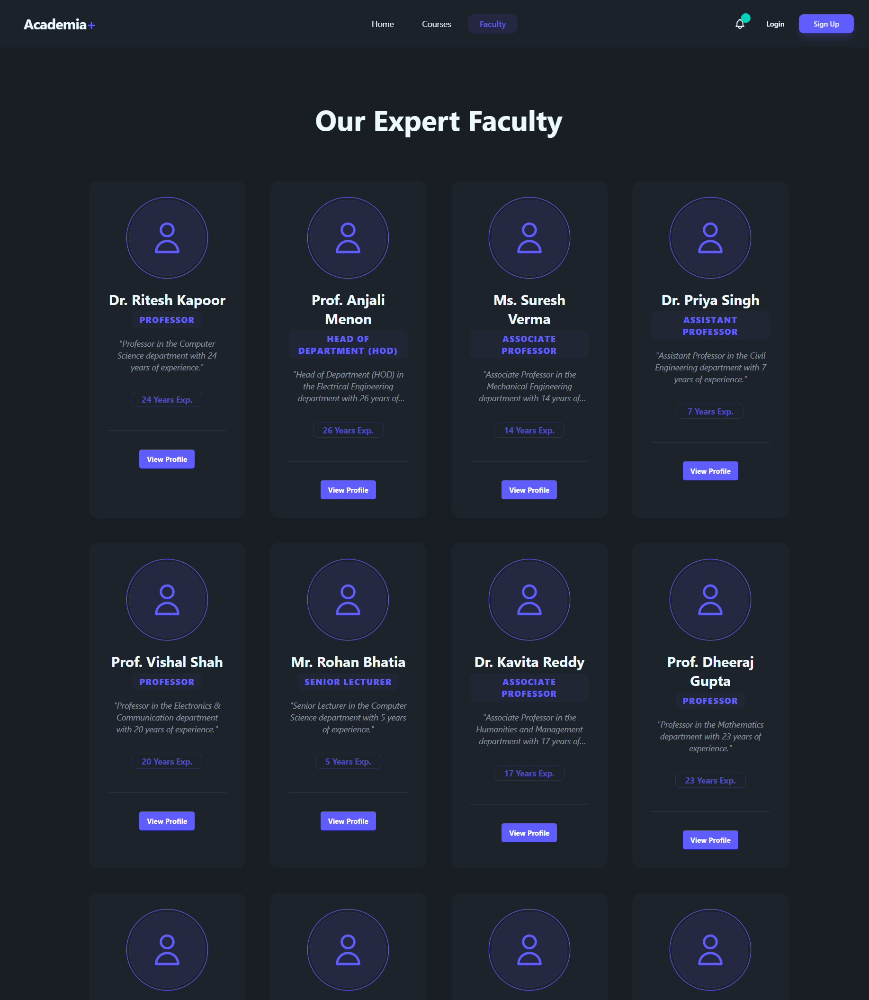
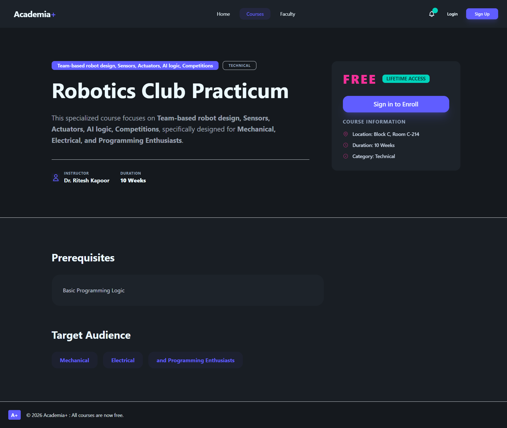

# Academia Plus 🎓

**Academia Plus** is a comprehensive College Extracurricular Course Management System designed to streamline the management of courses, faculty, and student enrollments. Built with a modern tech stack, it provides a seamless experience for students, faculty, and administrators.

## 🚀 Tech Stack

### **Frontend**
- **Framework**: [Angular](https://angular.io/) (v20.3.2)
- **Styling**: [TailwindCSS](https://tailwindcss.com/) (v4.1.18) & [DaisyUI](https://daisyui.com/)
- **Language**: TypeScript

### **Backend**
- **Framework**: [ASP.NET Core 8 Web API](https://dotnet.microsoft.com/en-us/apps/aspnet)
- **Database**: SQLite
- **ORM**: Entity Framework Core
- **Documentation**: Swagger / OpenAPI
- **Authentication**: JWT Bearer

---

## 🛠️ Prerequisites

Ensure you have the following installed on your machine:
- [Node.js](https://nodejs.org/) (Latest LTS recommended)
- [.NET 8 SDK](https://dotnet.microsoft.com/download/dotnet/8.0)
- [Angular CLI](https://angular.io/cli) (`npm install -g @angular/cli`)

---

## 🏁 Getting Started

Follow these steps to set up the project locally.

### 1. Backend Setup (API)

Navigate to the backend directory, restore dependencies, and start the server.

```bash
cd Backend
dotnet restore
dotnet run
```

The API will start at:
- **HTTPS**: `https://localhost:7120`
- **HTTP**: `http://localhost:5032`
- **Swagger UI**: [https://localhost:7120/swagger](https://localhost:7120/swagger)

### 2. Frontend Setup (Client)

Open a new terminal, navigate to the frontend directory, install dependencies, and start the application.

```bash
cd Frontend
npm install
ng serve
```

The application will be available at: **http://localhost:4200/**

---

## ✨ Key Features

- **User Roles**: Distinct portals for Students, Faculty, and Administrators.
- **Course Management**: View, search, and filter extracurricular courses.
- **Enrollment System**: Students can easily enroll in courses.
- **Faculty Management**: Admin tools to manage faculty profiles.
- **Modern UI**: Responsive and accessible design using TailwindCSS and DaisyUI.
- **Secure**: JWT-based authentication for secure access.

---

## 📸 Product Showcase

| **Home Page** |
|:---:|
|  |

| **User Profile** |
|:---:|
|  |

| **Login** |
|:---:|
|  |

| **Signup** |
|:---:|
|  |

| **Courses** |
|:---:|
|  |

| **Faculties** |
|:---:|
|  |

| **Course Details** |
|:---:|
|  |

| **Faculty Details** |
|:---:|
|  |

| **Admin Panel** |
|:---:|
|  |
---

## 📂 Project Structure

```
Academia Plus/
├── Backend/          # ASP.NET Core Web API project
│   ├── Controllers/  # API Controllers
│   ├── Data/         # Database Context & Migrations
│   ├── Models/       # Data Models (Entities)
│   └── User.db       # SQLite Database
├── Frontend/         # Angular Client Application
│   ├── src/
│   │   ├── app/      # Components & Services
│   │   └── assets/   # Static Assets
├── subjects table... # Data seeding files
└── faculty table...  # Data seeding files
```

---

## 📝 Notes

- The project uses **SQLite** for simplicity and portability. The database file `User.db` is located in the `Backend` directory.
- API documentation can be explored via the Swagger UI when the backend is running.
